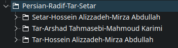
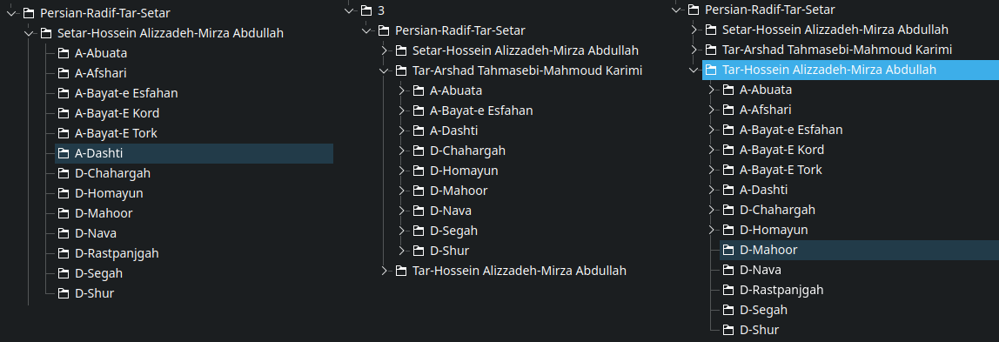
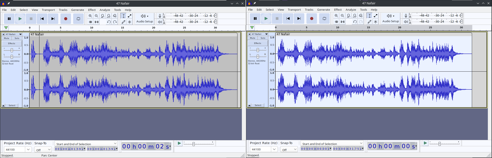
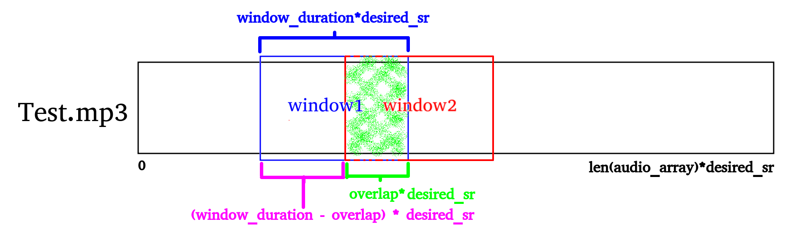
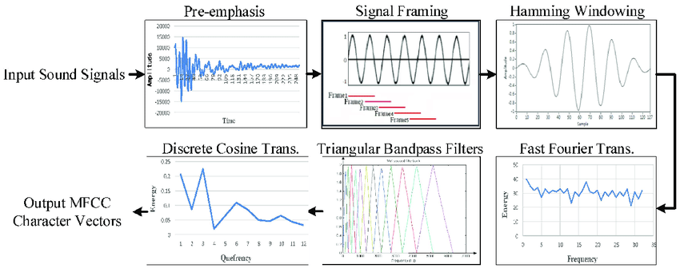
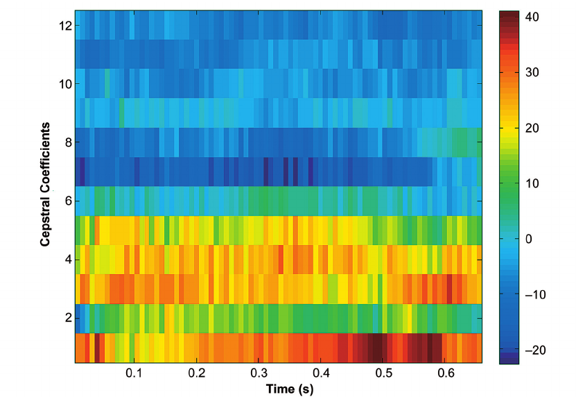

# Iranian-Traditional-Music-Genres-Classification

This project implements a convolutional neural network (CNN) model to classify music genres from audio recordings captured through a microphone. The model is trained on a dataset of 604 Persian classical music recordings, classified into 13 categories:

- 7 dastgahs: Homayun, Mahur, Shur, Segah, Chahargah, Rastpanjgah, Nava
- 6 avazs: Afshari, Dashti, Abu Atash, Bayati Tork, Bayati Esfahan, Bayati Kurd

### Data Preprocessing

The dataset was created by cleaning and processing music recordings from three albums. The following steps were taken to create the dataset:

1. The recordings were divided into albums and then into dastgahs and avazs.
2. The beginning of each recording, which typically contains human vocals, was removed.
3. The recordings were converted to mono and resampled.
4. The recordings were divided into windows with desired length and overlap.

<table>
  <tr>
    <td align="center">
      
       
      Albums
    </td>
    <td align="center">
        
         
      </td>
    </tr>
  <tr>
    <td align="center">
      
       
      Removing human vocals
    </td>
    <td align="center">
      
       
      windows
    </td>
  </tr>
</table>

### Feature Extraction

The Mel-frequency cepstrum (MFCC) is a popular feature extraction technique for audio signals. It captures the spectral characteristics of an audio signal in a way that is well-suited for human perception. The MFCC is calculated by applying a mel filterbank to the magnitude spectrum of an audio signal and then taking the logarithm of the energy in each filterbank.

<table>
  <tr>
    <td align="center">
      
       
    </td>
    <td align="center">
        
         
        dastgah-avaz
      </td>
    </tr>
</table>

### Model Architecture

The CNN model consists of Classification layers: 
- The classification layers consist of a series of convolutional layers, pooling layers, and fully-connected layers.
  - The convolutional layers extract spatial features from the MFCC features, the pooling layers reduce the dimensionality of the features, and the fully-connected layers learn a nonlinear mapping between the extracted features and the music genre labels.

### Training and Evaluation

The model was trained on the dataset of 998 Persian classical music recordings. The model was evaluated on a held-out test set and achieved an accuracy of 93.5%.

### Conclusion

The CNN model developed in this project demonstrates the feasibility of using deep learning for music genre classification from audio recordings captured through a microphone. The model achieves an accuracy of 93.5% on a held-out test set, which is significantly higher than the baseline accuracy of 50%. The model can be used for a variety of applications, such as real-time music genre detection, music recommendation, and music generation.

### Future Work

There are a number of ways to improve the performance of the model. One possibility is to use a larger dataset. Another possibility is to use a more complex model architecture. It would also be interesting to investigate the use of the model for other tasks, such as music transcription and music summarization.

